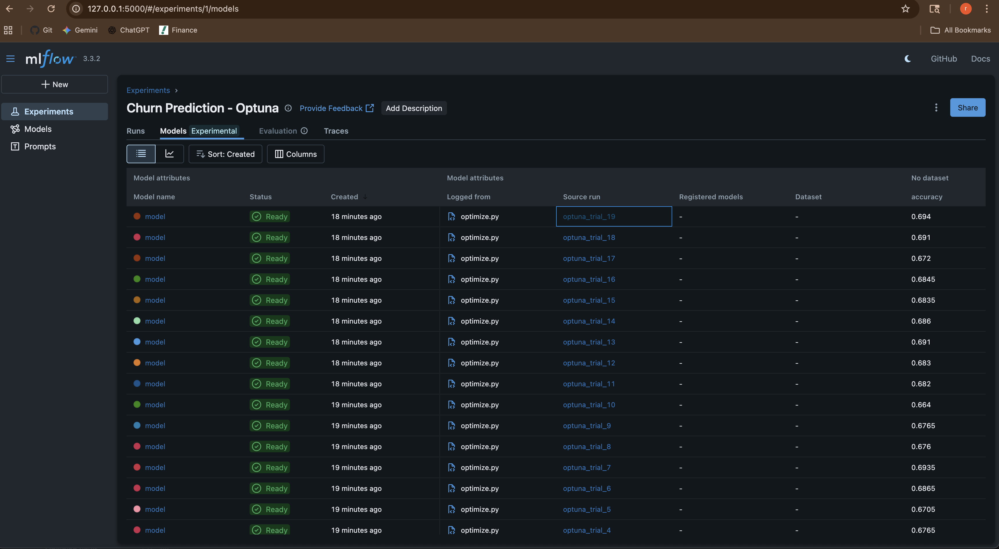
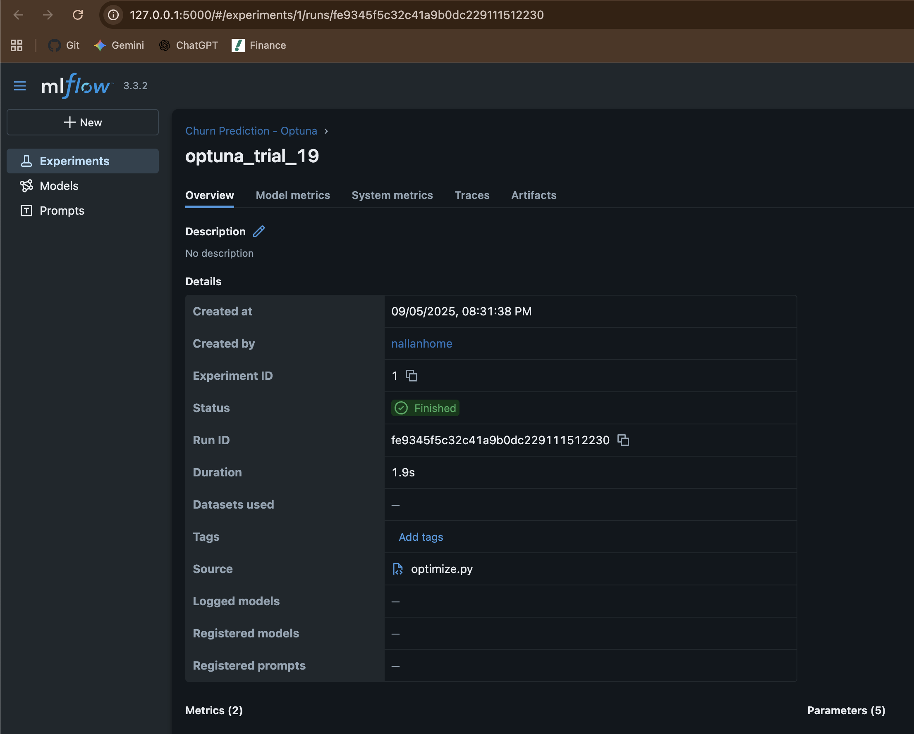
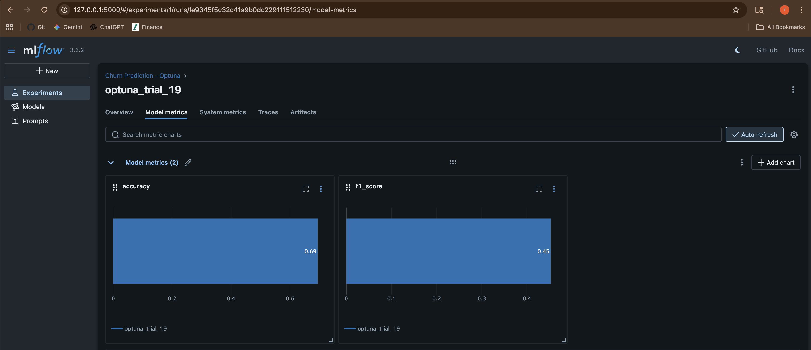

# Churn Prediction with Optuna & MLflow

This project demonstrates customer churn prediction using machine learning, with automated hyperparameter optimization and experiment tracking.

## Purpose

The purpose of this project is to provide a reproducible workflow for predicting customer churn using synthetic data. It showcases how to:
- Generate and preprocess data for churn modeling,
- Train and evaluate machine learning models,
- Automatically optimize model hyperparameters using Optuna,
- Track experiments, parameters, and results with MLflow,
- Select and deploy the best-performing model.

## Behavior

- **Data Generation:** Scripts generate synthetic customer and order data to simulate a real-world churn prediction scenario (see `data/generate_raw_data.py`).
- **Model Training:** Train a baseline model on the generated data (`train.py`), with MLflow logging all parameters, metrics, and artifacts for experiment tracking.
- **Hyperparameter Optimization:** `optimize.py` uses Optuna to search for the best hyperparameters, calling the training logic for each trial and logging results to MLflow.
- **Experiment Tracking:** MLflow records all experiments, metrics, and artifacts for easy comparison and reproducibility.
- **Model Selection:** The best model can be identified and loaded for deployment or further analysis.

## Features

- **Synthetic Data Generation:** Easily generate realistic customer and order data for modeling.
- **Model Training:** Train churn prediction models using XGBoost or other algorithms.
- **Hyperparameter Optimization:** Use Optuna to automatically search for the best model parameters.
- **Experiment Tracking:** Track all experiments, parameters, and results with MLflow.
- **Model Selection:** Identify and load the best-performing model for deployment or further analysis.

## Project Structure

```
churn_optuna_mlflow/
  data/
    customers.csv
    orders.csv
    raw_customers.csv
    generate_data.py
  createmodel.py
  find_selected_model.py
  generate_raw_data.py
  optimize.py
  train.py
  requirements.txt
  install.md
  xgboost.md
  mlruns/
```

## Setup & Usage

See [install.md](./install.md) for detailed installation, setup, and usage instructions.

## Notes

- All experiments and models are tracked in the `mlruns/` directory using MLflow.
- You can customize data generation or model parameters by editing the respective scripts.
- See `xgboost.md` for XGBoost-specific notes.

## Requirements

- Python 3.8+
- See `requirements.txt` for Python package dependencies.


## Screenshots after the run



---

For more details, refer to the individual script files or open an issue.