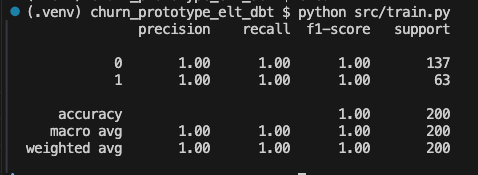

# Churn Prototype ELT with dbt

This project is a prototype pipeline for customer churn analysis using an ELT (Extract, Load, Transform) workflow powered by [dbt](https://www.getdbt.com/) and machine learning model training.

Model: is to prect customer churn using input data.
Uses LogisticRegression

---

## Project Overview

The pipeline demonstrates the following steps:

1. **Environment Setup**
   - Installs PostgreSQL as the database backend.
   - Installs `dbt-postgres` for dbt to interact with Postgres.
   - Sets up a Python virtual environment and installs required Python packages:
     - `pandas`, `scikit-learn` (for data processing and ML)
     - `sqlalchemy`, `psycopg2-binary` (for database interaction)
     - `dbt-postgres` (for dbt transformations)

2. **Data Generation**
   - Runs `src/generate_raw_data.py` to create synthetic datasets:
     - `customers.csv`
     - `orders.csv`

3. **Data Loading**
   - Runs `load_data.py` to load the generated CSVs into the Postgres database:
     - Loads data into `raw_customers` and `raw_order` tables.

4. **Data Transformation with dbt**
   - Uses dbt to manage transformations:
     - `dbt debug` checks the connection.
     - `dbt run` executes SQL models (under the `models` directory as defined in `dbt_project.yml`):
       - Creates the `churn_features` table in the `analytics` schema.
       - Creates views: `stg_customers` and `stg_orders`.
     - `dbt test` runs any defined data tests.
     - `dbt docs generate` and `dbt docs serve` generate and serve documentation, including lineage visualization.

5. **Machine Learning**
   - Runs `src/train.py` to train a churn prediction model:
     - Uses the `analytics.churn_features` table as the training dataset.
     

---

## Summary

- **ELT Pipeline:** Generates synthetic data → loads into Postgres → transforms with dbt → trains ML model.
- **dbt:** Handles SQL-based data transformation and lineage.
- **Machine Learning:** Trains a churn model using the transformed features.

---

## Getting Started

For installation and step-by-step usage, see [install.md](./install.md).