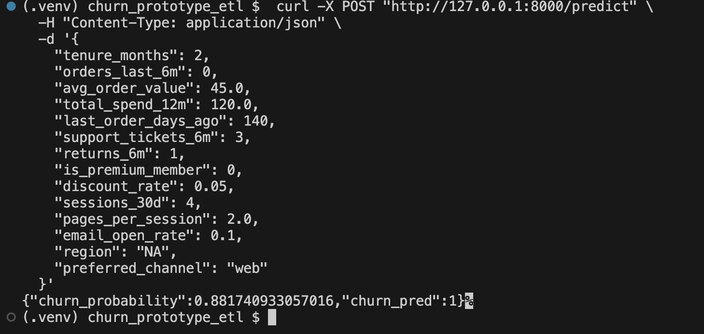

1. __Unzip and enter the project__
 ```bash
 unzip churn_prototype.zip
 cd churn_prototype
 ```

2. __Create a virtual environment and install deps__
 ```bash
 python3 -m venv .venv
 source .venv/bin/activate
 python -m pip install --upgrade pip
 pip install -r requirements.txt
 ```

3. __Generate synthetic data (10k rows)__
 ```bash
 python src/data/generate_data.py --n 10000 --out data/churn.csv
 ```

4. __Train the model (saves model + metrics)__
 ```bash
 python src/models/train.py --data data/churn.csv --model models/model.joblib --metrics metrics/metrics.json
 ```

5. __Evaluate (writes reports/confusion_matrix.png and classification_report.json)__
 ```bash
 python src/models/evaluate.py --data data/churn.csv --model models/model.joblib --outdir reports
 ```

6. __Serve the model (REST API at http://127.0.0.1:8000)__
 ```bash
 uvicorn src.serve.app:app --reload --port 8000
 ```

7. __(New terminal) Test a prediction__
 ```bash
 curl -X POST "http://127.0.0.1:8000/predict" \
  -H "Content-Type: application/json" \
  -d '{
    "tenure_months": 2,
    "orders_last_6m": 0,
    "avg_order_value": 45.0,
    "total_spend_12m": 120.0,
    "last_order_days_ago": 140,
    "support_tickets_6m": 3,
    "returns_6m": 1,
    "is_premium_member": 0,
    "discount_rate": 0.05,
    "sessions_30d": 4,
    "pages_per_session": 2.0,
    "email_open_rate": 0.1,
    "region": "NA",
    "preferred_channel": "web"
  }'
 ```
 

8. __Batch scoring (scores the CSV and writes predictions)__
 ```bash
 python src/batch/score_batch.py --model models/model.joblib --in data/churn.csv --out data/predictions.csv
 ```